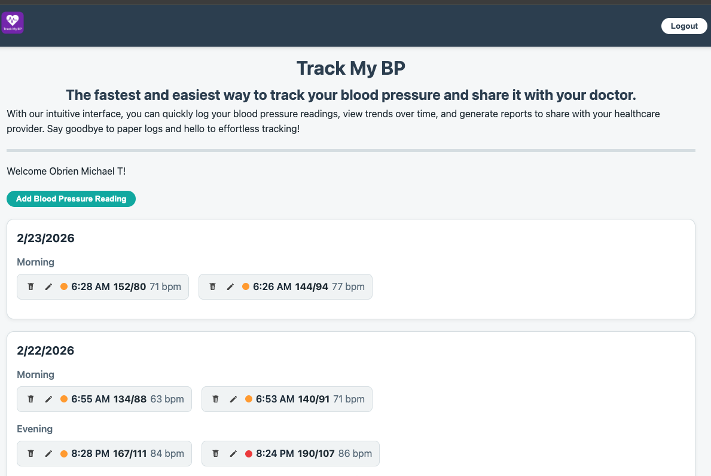

# Track My BP

This site is developed to provide an easy, straightforward way for users to track their blood pressure readings without having to jump through hoops. You can quickly enter readings, log multiple readings for the same day, edit and delete readings.



## Deployed site

[Track My BP](https://trackmybp.netlify.app/)

## Technology Used

- Vue.js
- bcrypt.js
- JWT
- Netlify "serverless" backend that includes:
  * Postgresql database
- Resend

## Project Setup

To run this locally clone this reposity onto your local machine. Change directory into the mybp directory and run:
```sh
npm install
```
Push the application to your Github and then deploy it to Netlify. After deploying to Netlify install the Netlify CLI:
```sh
npm install -g netlify-cli
```

### Launch Application

```sh
netlify dev
```

### Compile and Minify for Production

```sh
npm run build
```
